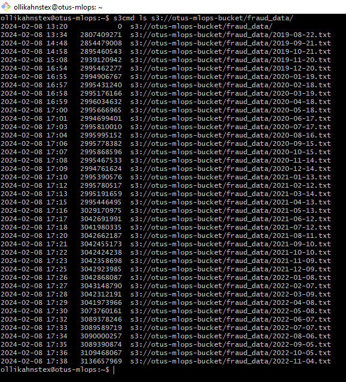
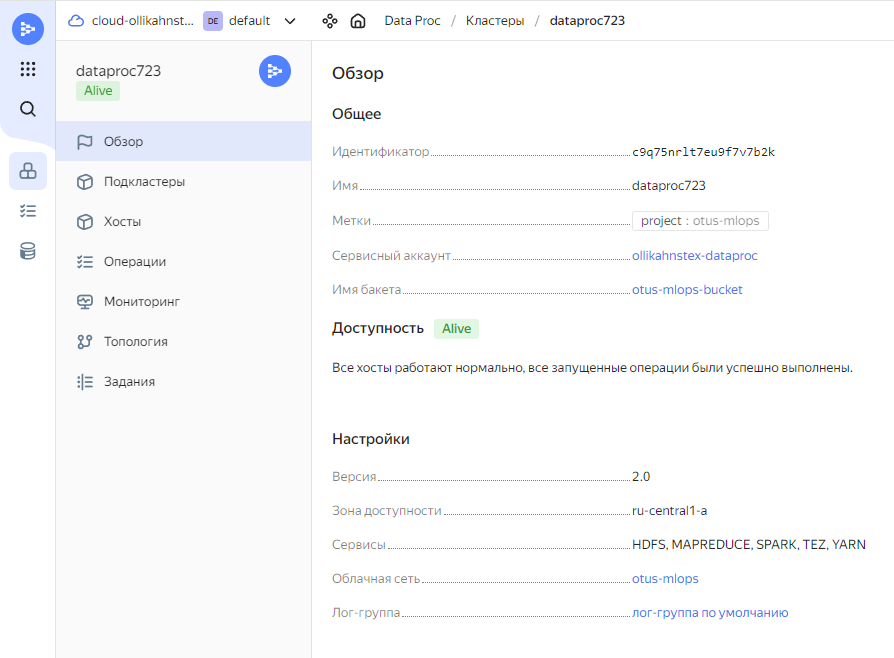
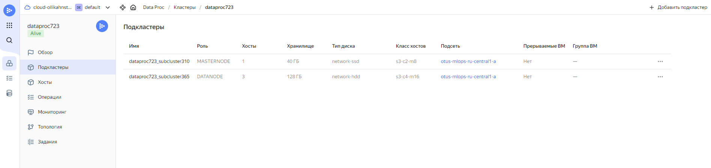
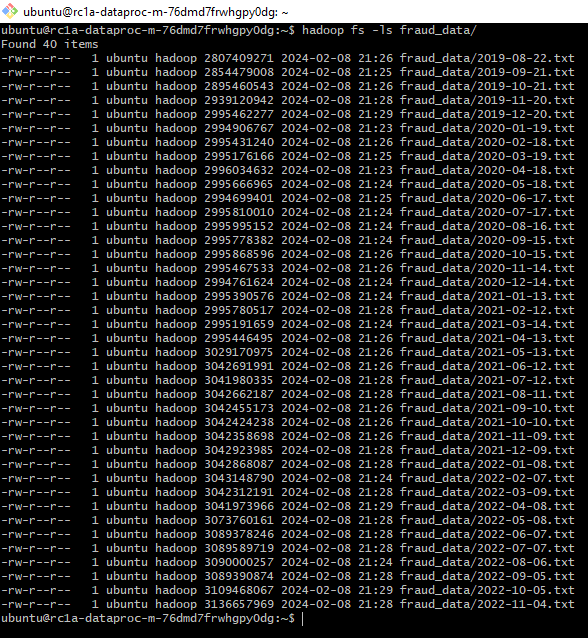

# Отчёт по ДЗ №2

## Хранение данных

Данные по транзакциям перенесены в объектное хранилище: **s3://otus-mlops-bucket/fraud_data/** 
(bucket: https://storage.yandexcloud.net/otus-mlops-bucket)
  
Перенос выполнен командой `s3cmd sync s3://mlops-data/fraud-data/ s3://otus-mlops-bucket/fraud_data/ --acl-public`.
Без последнего ключа возникала ошибка Access Denied.

Также был создан Spark-кластер в DataProc с двумя подкластерами.  
  
  
Данные из объектного хранилища были скопированы в HDFS-хранилище.  
  
  
  

## Оценка стоимости
Не совсем понял, как правильно оценить стоимость S3-хранилища (возможно, пока не хватает понимания пайплайна
раблоты с этими данными).
[Нашёл](https://cloud.yandex.ru/ru/docs/storage/pricing?from=int-console-help-center-or-nav)
цены в районе 0,39 руб. на каждые 10k GET или 0,48 руб. на каждые 1k PUT. Сколько таких операций будет,
сложно сказать, но вряд ли миллионом исчислится. PUT ну путь каждый день по разу -- считай, ноль.
Ну пусть миллион GET (уйма экспериментов, при которых всегда зачем-то будет обращаться заново 
к хранилищу): 39 рублей. **Пусть 40 вместе**. Ещё для стандартного хранилища 2 руб. за 1 ГБ в мес.,
у нас 120 ГБ примерно, то есть ещё **240 руб. в мес.** Ну и исходящий трафик (в Spark-кластер,
например, кидали) типа 1,5 руб. за 100 ГБ -- 1000 ГБ, будто бы ничего. Итого: ну **несколько сотен руб. в мес**. 

- **Spark-кластер: 26236.08 руб. / мес.**
  - Мастер-подкластер: 4119.60 руб. / мес.
    - Хост 1: 4119.60 руб. / мес.
  - Data-подкластер: 22116.48 руб. / мес.
    - Хост 2: 7487.36 руб. / мес. (случайно создал публичный IP-адрес)
    - Хост 3: 7314.56 руб. / мес.
    - Хост 4: 7314.56 руб. / мес.

Spark на пару порядков дороже. Можно быть на хостах попроще CPU-шки сделать, оперативки по 16 ГБ на каждом
data-хосте не надо, наверное. 128 ГБ постоянной памяти на каждом data-хосте тоже кажется излишним.
Да и трёх data-хостов, возможно, много, двух хватит.
