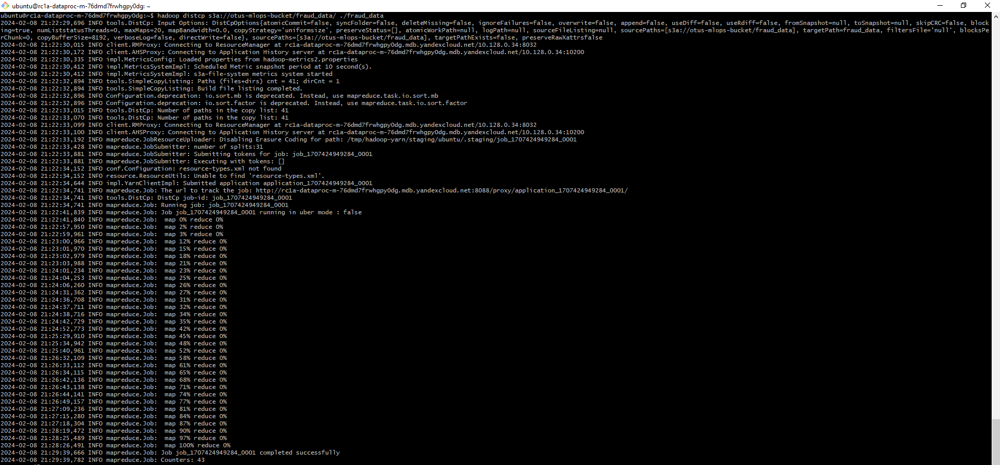
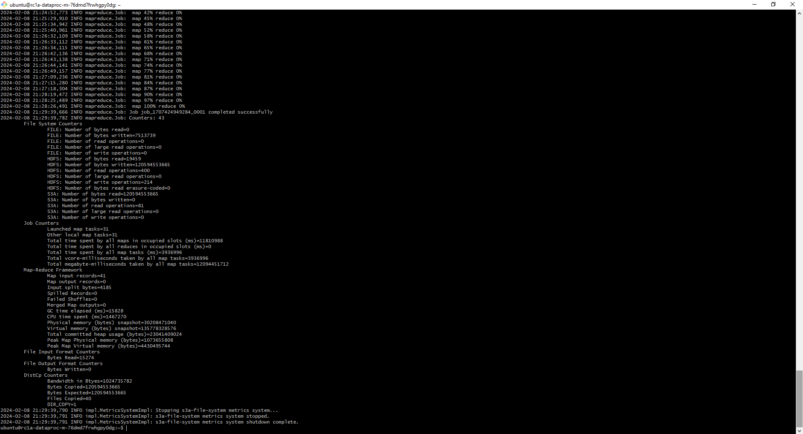

# Отчёт по ДЗ №2

Данные по транзакциям перенесены в объектное хранилище: **s3://otus-mlops-bucket/fraud_data/**  
  
Перенос выполнен командой `s3cmd sync s3://mlops-data/fraud-data/ s3://otus-mlops-bucket/fraud_data/ --acl-public`.
Без последнего ключа возникала ошибка Access Denied.

Также был создан Spark-кластер в DataProc с двумя подкластерами.  
  
  
Данные из объектного хранилища были скопированы в HDFS-хранилище.  
  
  
  
