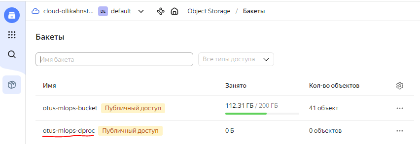
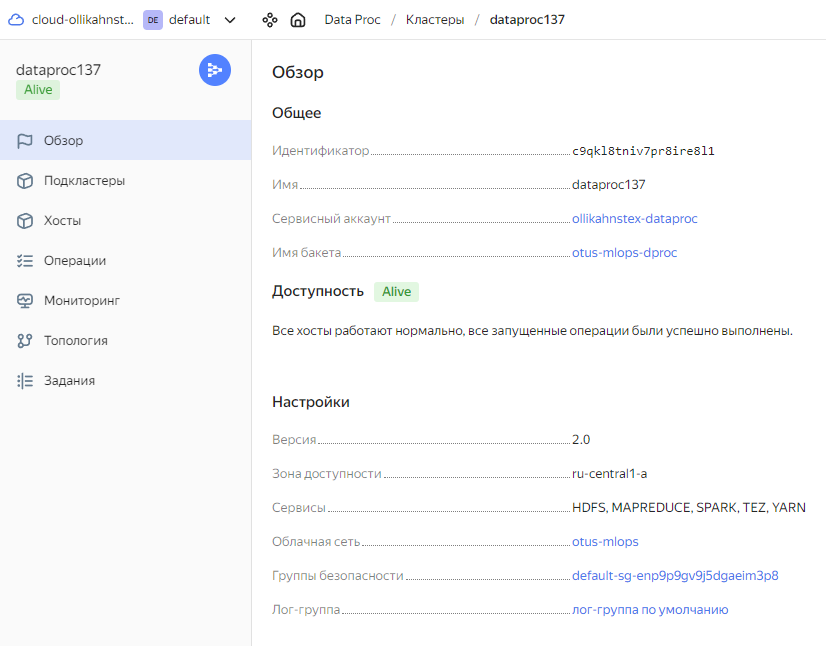
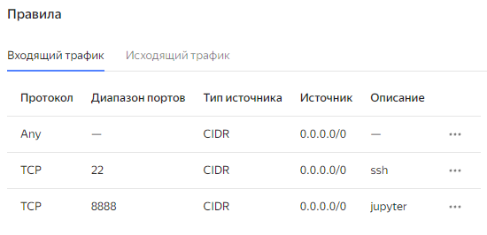
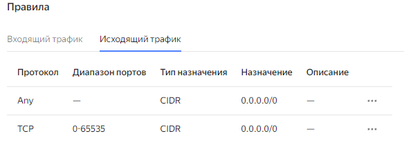
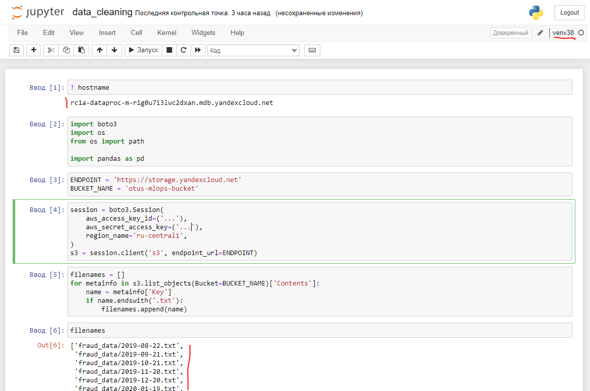
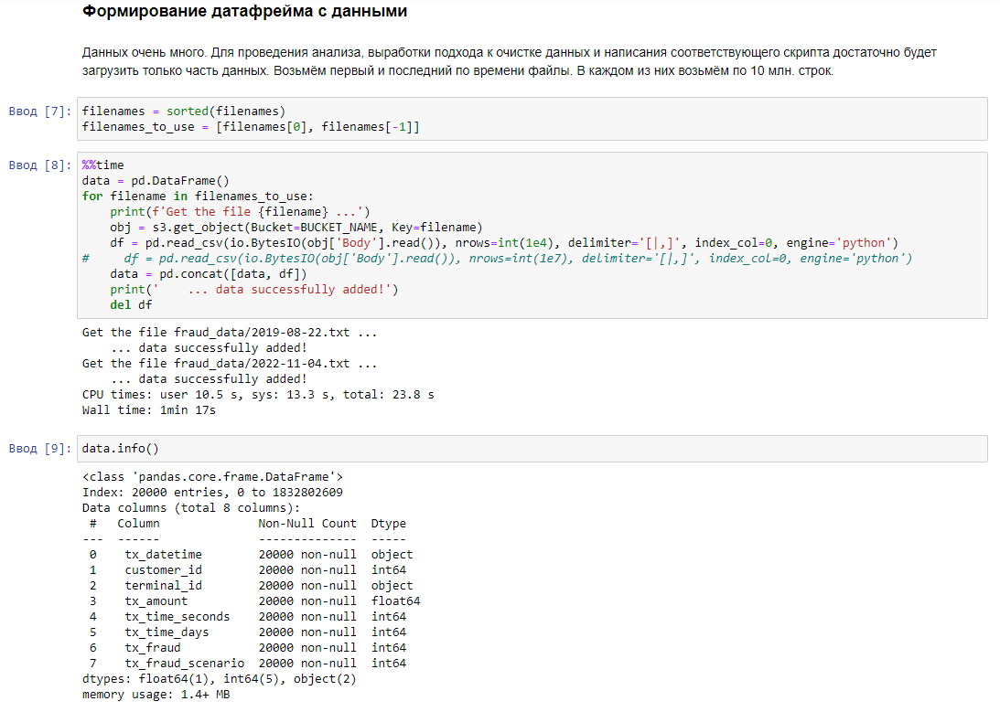
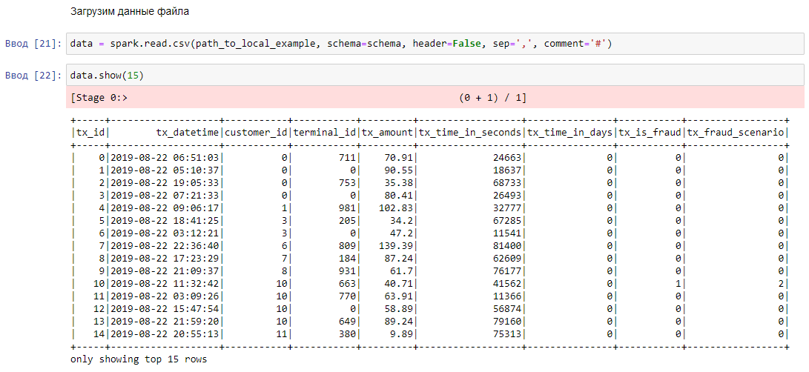
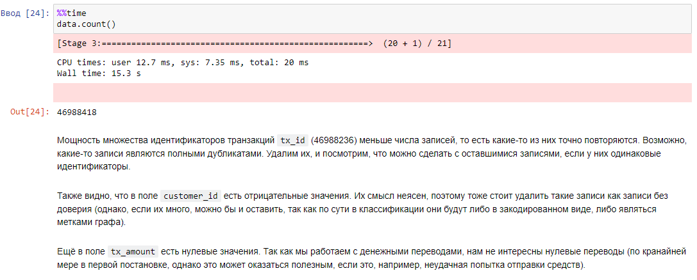
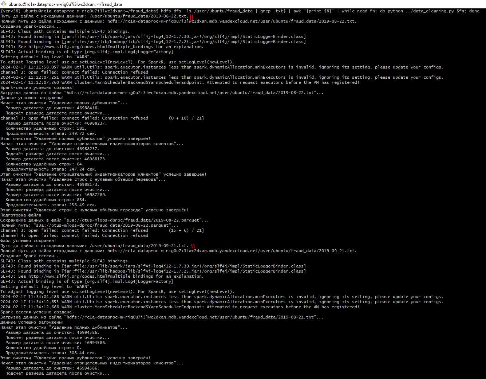
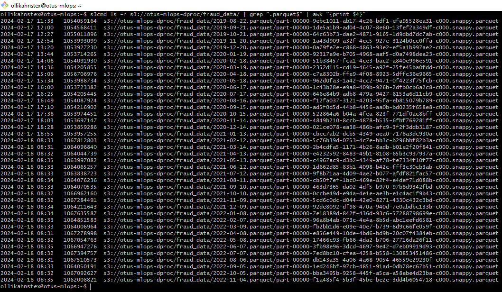

# Отчёт по ДЗ №3

## Очистка данных
В рамках ДЗ в Yandex Cloud Object Storage был создан новый bucket:  
**https://storage.yandexcloud.net/otus-mlops-dproc**.  
  

Был создан новый Spark-кластер с привязкой к данному bucket'у.  

  
Соответствующим образом была настроена группа безопасности.  
  
  

Для анализа данных использовал Jupyter Notebook на мастер-ноде кластера. Создал виртуальное окружение,
подключил его к Kernel'ам, создал сессию подключения к s3-хранилищу с данными по транзакциям.  
  

Данные из s3-хранилища небольшим объёмом (тысяч по 10-50 строк из пары файлов) шли быстро (пара минут),
а вот объёме 10 млн. строк уже выгружались заметно дольше.  
  
По каким-то причинам периодически подключение к кластеру терялось, и kernel вырубался, а соответственно
данные выпадали из оператвной памяти. Много времени на это ушло, поэтому решил всё-таки перенести данные
на Spark-кластер на время обработки по аналогии с ДЗ №2 (возможно, так и подразумевалось изначально).  

Обработка данных шла крайне долго: фильтрации и/или агрегации занимали 5-15 минут. В связи с этим
было решено для составления скрипта вести анализ только на одном файле датасета.  
  
  

Jupyter Notebook с тестовой обработкой данных:
[data_cleaning.ipynb](data_cleaning.ipynb)

После отладки кода на тестовом примере был написан python-скрипт обработки данных на PySpark:
[data_cleaning.py](../data_cleaning.py)

Данный скрипт принимает на вход путь до файла на HDFS Spark-кластера, чистит файл и сохраняет его в формате
`parquet` на s3-хранилище в ранее созданном бакете **https://storage.yandexcloud.net/otus-mlops-dproc**.
Для запуска этого скрипта на каждом файле с транзакциями из HDFS я выполнили bash-команду, которая
составляет список путей до всех файлов `.txt` на HDFS и передаёт их имена в python-скрипт.
```bash
hdfs dfs -ls /user/ubuntu/fraud_data | grep .txt$ | awk '{print $8}' | while read fn; do python ../data_cleaning.py $fn; done
```  
  
  
Обработка одно файла занимала около получаса (далее в статистике есть время каждого этапа очистки, однако
не фиксировалось время создания Spark-сессии и время сохранения файла).


## Статистика очистки файлов
**Общее число  удалённых строк: 52436 из 5639362685 (0.000930 %)**  

1. Файл `2019-08-22.txt`.
    1. Размер файла в формате `.txt`: 2807 МБ 
    2. Этап очистки "Удаление полных дубликатов":
        - Размер датасета до очистки: 46988418.
        - Размер датасета после очистки: 46988237.
        - Количество удалённых строк: 181.
        - Продолжительность этапа: 249.72 сек.
    3. Этап очистки "Удаление отрицательных индентификаторов клиентов":
        - Размер датасета до очистки: 46988237.
        - Размер датасета после очистки: 46988173.
        - Количество удалённых строк: 64.
        - Продолжительность этапа: 247.24 сек.
    4. Этап очистки "Удаление строк с нулевым объёмом перевода":
        - Размер датасета до очистки: 46988173.
        - Размер датасета после очистки: 46987289.
        - Количество удалённых строк: 884.
        - Продолжительность этапа: 256.49 сек.
    5. Размер файла в формате `.parquet`: 1054 МБ 
2. Файл `2019-09-21.txt`.
    1. Размер файла в формате `.txt`: 2854 МБ 
    2. Этап очистки "Удаление полных дубликатов":
        - Размер датасета до очистки: 46994586.
        - Размер датасета после очистки: 46994586.
        - Количество удалённых строк: 0.
        - Продолжительность этапа: 308.44 сек.
    3. Этап очистки "Удаление отрицательных индентификаторов клиентов":
        - Размер датасета до очистки: 46994586.
        - Размер датасета после очистки: 46994211.
        - Количество удалённых строк: 375.
        - Продолжительность этапа: 348.90 сек.
    4. Этап очистки "Удаление строк с нулевым объёмом перевода":
        - Размер датасета до очистки: 46994211.
        - Размер датасета после очистки: 46993291.
        - Количество удалённых строк: 920.
        - Продолжительность этапа: 341.34 сек.
    5. Размер файла в формате `.parquet`: 1054 МБ 
3. Файл `2019-10-21.txt`.
    1. Размер файла в формате `.txt`: 2895 МБ 
    2. Этап очистки "Удаление полных дубликатов":
        - Размер датасета до очистки: 46994432.
        - Размер датасета после очистки: 46994326.
        - Количество удалённых строк: 106.
        - Продолжительность этапа: 311.40 сек.
    3. Этап очистки "Удаление отрицательных индентификаторов клиентов":
        - Размер датасета до очистки: 46994326.
        - Размер датасета после очистки: 46994326.
        - Количество удалённых строк: 0.
        - Продолжительность этапа: 352.11 сек.
    4. Этап очистки "Удаление строк с нулевым объёмом перевода":
        - Размер датасета до очистки: 46994326.
        - Размер датасета после очистки: 46993489.
        - Количество удалённых строк: 837.
        - Продолжительность этапа: 321.23 сек.
    5. Размер файла в формате `.parquet`: 1055 МБ 
4. Файл `2019-11-20.txt`.
    1. Размер файла в формате `.txt`: 2939 МБ 
    2. Этап очистки "Удаление полных дубликатов":
        - Размер датасета до очистки: 46992239.
        - Размер датасета после очистки: 46992150.
        - Количество удалённых строк: 89.
        - Продолжительность этапа: 327.18 сек.
    3. Этап очистки "Удаление отрицательных индентификаторов клиентов":
        - Размер датасета до очистки: 46992150.
        - Размер датасета после очистки: 46992038.
        - Количество удалённых строк: 112.
        - Продолжительность этапа: 317.32 сек.
    4. Этап очистки "Удаление строк с нулевым объёмом перевода":
        - Размер датасета до очистки: 46992038.
        - Размер датасета после очистки: 46991146.
        - Количество удалённых строк: 892.
        - Продолжительность этапа: 316.91 сек.
    5. Размер файла в формате `.parquet`: 1053 МБ 
5. Файл `2019-12-20.txt`.
    1. Размер файла в формате `.txt`: 2995 МБ 
    2. Этап очистки "Удаление полных дубликатов":
        - Размер датасета до очистки: 46994937.
        - Размер датасета после очистки: 46994937.
        - Количество удалённых строк: 0.
        - Продолжительность этапа: 334.35 сек.
    3. Этап очистки "Удаление отрицательных индентификаторов клиентов":
        - Размер датасета до очистки: 46994937.
        - Размер датасета после очистки: 46994937.
        - Количество удалённых строк: 0.
        - Продолжительность этапа: 321.80 сек.
    4. Этап очистки "Удаление строк с нулевым объёмом перевода":
        - Размер датасета до очистки: 46994937.
        - Размер датасета после очистки: 46994074.
        - Количество удалённых строк: 863.
        - Продолжительность этапа: 325.63 сек.
    5. Размер файла в формате `.parquet`: 1053 МБ 
6. Файл `2019-01-19.txt`.
    1. Размер файла в формате `.txt`: 2994 МБ 
    2. Этап очистки "Удаление полных дубликатов":
        - Размер датасета до очистки: 46986197.
        - Размер датасета после очистки: 46986151.
        - Количество удалённых строк: 46.
        - Продолжительность этапа: 285.63 сек.
    3. Этап очистки "Удаление отрицательных индентификаторов клиентов":
        - Размер датасета до очистки: 46986151.
        - Размер датасета после очистки: 46986142.
        - Количество удалённых строк: 9.
        - Продолжительность этапа: 281.74 сек.
    4. Этап очистки "Удаление строк с нулевым объёмом перевода":
        - Размер датасета до очистки: 46986142.
        - Размер датасета после очистки: 46985273.
        - Количество удалённых строк: 869.
        - Продолжительность этапа: 268.58 сек.
    5. Размер файла в формате `.parquet`: 1053 МБ 
7. Файл `2019-02-18.txt`.
    1. Размер файла в формате `.txt`: 2995 МБ 
    2. Этап очистки "Удаление полных дубликатов":
        - Размер датасета до очистки: 46994271.
        - Размер датасета после очистки: 46994271.
        - Количество удалённых строк: 0.
        - Продолжительность этапа: 303.01 сек.
    3. Этап очистки "Удаление отрицательных индентификаторов клиентов":
        - Размер датасета до очистки: 46994271.
        - Размер датасета после очистки: 46994271.
        - Количество удалённых строк: 0.
        - Продолжительность этапа: 288.38 сек.
    4. Этап очистки "Удаление строк с нулевым объёмом перевода":
        - Размер датасета до очистки: 46994271.
        - Размер датасета после очистки: 46993408.
        - Количество удалённых строк: 863.
        - Продолжительность этапа: 287.85 сек.
    5. Размер файла в формате `.parquet`: 1054 МБ 
8. Файл `2019-03-19.txt`.
    1. Размер файла в формате `.txt`: 2995 МБ 
    2. Этап очистки "Удаление полных дубликатов":
        - Размер датасета до очистки: 46990424.
        - Размер датасета после очистки: 46990424.
        - Количество удалённых строк: 0.
        - Продолжительность этапа: 338.32 сек.
    3. Этап очистки "Удаление отрицательных индентификаторов клиентов":
        - Размер датасета до очистки: 46990424.
        - Размер датасета после очистки: 46990065.
        - Количество удалённых строк: 359.
        - Продолжительность этапа: 339.36 сек.
    4. Этап очистки "Удаление строк с нулевым объёмом перевода":
        - Размер датасета до очистки: 46990065.
        - Размер датасета после очистки: 46989187.
        - Количество удалённых строк: 878.
        - Продолжительность этапа: 324.48 сек.
    5. Размер файла в формате `.parquet`: 1054 МБ 
9. Файл `2020-04-18.txt`.
    1. Размер файла в формате `.txt`: 2996 МБ 
    2. Этап очистки "Удаление полных дубликатов":
        - Размер датасета до очистки: 47001235.
        - Размер датасета после очистки: 47001180.
        - Количество удалённых строк: 55.
        - Продолжительность этапа: 515.94 сек.
    3. Этап очистки "Удаление отрицательных индентификаторов клиентов":
        - Размер датасета до очистки: 47001180.
        - Размер датасета после очистки: 47000280.
        - Количество удалённых строк: 900.
        - Продолжительность этапа: 287.03 сек.
    4. Этап очистки "Удаление строк с нулевым объёмом перевода":
        - Размер датасета до очистки: 47000280.
        - Размер датасета после очистки: 46999395.
        - Количество удалённых строк: 885.
        - Продолжительность этапа: 318.00 сек.
    5. Размер файла в формате `.parquet`: 1056 МБ 
10. Файл `2020-05-18.txt`.
    1. Размер файла в формате `.txt`: 2995 МБ 
    2. Этап очистки "Удаление полных дубликатов":
        - Размер датасета до очистки: 46998002.
        - Размер датасета после очистки: 46997815.
        - Количество удалённых строк: 187.
        - Продолжительность этапа: 323.69 сек.
    3. Этап очистки "Удаление отрицательных индентификаторов клиентов":
        - Размер датасета до очистки: 46997815.
        - Размер датасета после очистки: 46997815.
        - Количество удалённых строк: 0.
        - Продолжительность этапа: 325.62 сек.
    4. Этап очистки "Удаление строк с нулевым объёмом перевода":
        - Размер датасета до очистки: 46997815.
        - Размер датасета после очистки: 46996951.
        - Количество удалённых строк: 864.
        - Продолжительность этапа: 342.92 сек.
    5. Размер файла в формате `.parquet`: 1053 МБ 
11. Файл `2020-06-17.txt`.
    1. Размер файла в формате `.txt`: 2994 МБ 
    2. Этап очистки "Удаление полных дубликатов":
        - Размер датасета до очистки: 46983063.
        - Размер датасета после очистки: 46983063.
        - Количество удалённых строк: 0.
        - Продолжительность этапа: 312.45 сек.
    3. Этап очистки "Удаление отрицательных индентификаторов клиентов":
        - Размер датасета до очистки: 46983063.
        - Размер датасета после очистки: 46982126.
        - Количество удалённых строк: 937.
        - Продолжительность этапа: 313.06 сек.
    4. Этап очистки "Удаление строк с нулевым объёмом перевода":
        - Размер датасета до очистки: 46982126.
        - Размер датасета после очистки: 46981199.
        - Количество удалённых строк: 927.
        - Продолжительность этапа: 311.48 сек.
    5. Размер файла в формате `.parquet`: 1053 МБ 
12. Файл `2020-07-17.txt`.
    1. Размер файла в формате `.txt`: 2995 МБ 
    2. Этап очистки "Удаление полных дубликатов":
        - Размер датасета до очистки: 47000292.
        - Размер датасета после очистки: 47000292.
        - Количество удалённых строк: 0.
        - Продолжительность этапа: 316.36 сек.
    3. Этап очистки "Удаление отрицательных индентификаторов клиентов":
        - Размер датасета до очистки: 47000292.
        - Размер датасета после очистки: 46999943.
        - Количество удалённых строк: 349.
        - Продолжительность этапа: 299.80 сек.
    4. Этап очистки "Удаление строк с нулевым объёмом перевода":
        - Размер датасета до очистки: 46999943.
        - Размер датасета после очистки: 46999075.
        - Количество удалённых строк: 868.
        - Продолжительность этапа: 296.91 сек.
    5. Размер файла в формате `.parquet`: 1054 МБ 
13. Файл `2020-08-16.txt`.
    1. Размер файла в формате `.txt`: 2995 МБ 
    2. Этап очистки "Удаление полных дубликатов":
        - Размер датасета до очистки: 47003159.
        - Размер датасета после очистки: 47003159.
        - Количество удалённых строк: 0.
        - Продолжительность этапа: 325.47 сек.
    3. Этап очистки "Удаление отрицательных индентификаторов клиентов":
        - Размер датасета до очистки: 47003159.
        - Размер датасета после очистки: 47002441.
        - Количество удалённых строк: 718.
        - Продолжительность этапа: 275.42 сек.
    4. Этап очистки "Удаление строк с нулевым объёмом перевода":
        - Размер датасета до очистки: 47002441.
        - Размер датасета после очистки: 47001626.
        - Количество удалённых строк: 815.
        - Продолжительность этапа: 280.50 сек.
    5. Размер файла в формате `.parquet`: 1054 МБ 
14. Файл `2020-09-15.txt`.
    1. Размер файла в формате `.txt`: 2995 МБ 
    2. Этап очистки "Удаление полных дубликатов":
        - Размер датасета до очистки: 46999865.
        - Размер датасета после очистки: 46999844.
        - Количество удалённых строк: 21.
        - Продолжительность этапа: 251.75 сек.
    3. Этап очистки "Удаление отрицательных индентификаторов клиентов":
        - Размер датасета до очистки: 46999844.
        - Размер датасета после очистки: 46999059.
        - Количество удалённых строк: 785.
        - Продолжительность этапа: 264.27 сек.
    4. Этап очистки "Удаление строк с нулевым объёмом перевода":
        - Размер датасета до очистки: 46999059.
        - Размер датасета после очистки: 46998188.
        - Количество удалённых строк: 871.
        - Продолжительность этапа: 248.97 сек.
    5. Размер файла в формате `.parquet`: 1054 МБ 
15. Файл `2020-10-15.txt`.
    1. Размер файла в формате `.txt`: 2995 МБ 
    2. Этап очистки "Удаление полных дубликатов":
        - Размер датасета до очистки: 47001238.
        - Размер датасета после очистки: 47001093.
        - Количество удалённых строк: 145.
        - Продолжительность этапа: 358.91 сек.
    3. Этап очистки "Удаление отрицательных индентификаторов клиентов":
        - Размер датасета до очистки: 47001093.
        - Размер датасета после очистки: 47000928.
        - Количество удалённых строк: 165.
        - Продолжительность этапа: 351.47 сек.
    4. Этап очистки "Удаление строк с нулевым объёмом перевода":
        - Размер датасета до очистки: 47000928.
        - Размер датасета после очистки: 47000076.
        - Количество удалённых строк: 852.
        - Продолжительность этапа: 339.41 сек.
    5. Размер файла в формате `.parquet`: 1053 МБ 
16. Файл `2020-11-14.txt`.
    1. Размер файла в формате `.txt`: 2995 МБ 
    2. Этап очистки "Удаление полных дубликатов":
        - Размер датасета до очистки: 46995020.
        - Размер датасета после очистки: 46994835.
        - Количество удалённых строк: 185.
        - Продолжительность этапа: 313.54 сек.
    3. Этап очистки "Удаление отрицательных индентификаторов клиентов":
        - Размер датасета до очистки: 46994835.
        - Размер датасета после очистки: 46994608.
        - Количество удалённых строк: 227.
        - Продолжительность этапа: 308.32 сек.
    4. Этап очистки "Удаление строк с нулевым объёмом перевода":
        - Размер датасета до очистки: 46994608.
        - Размер датасета после очистки: 46993703.
        - Количество удалённых строк: 905.
        - Продолжительность этапа: 307.52 сек.
    5. Размер файла в формате `.parquet`: 1053 МБ 
17. Файл `2020-12-14.txt`.
    1. Размер файла в формате `.txt`: 2994 МБ 
    2. Этап очистки "Удаление полных дубликатов":
        - Размер датасета до очистки: 46983905.
        - Размер датасета после очистки: 46983905.
        - Количество удалённых строк: 0.
        - Продолжительность этапа: 300.10 сек.
    3. Этап очистки "Удаление отрицательных индентификаторов клиентов":
        - Размер датасета до очистки: 46983905.
        - Размер датасета после очистки: 46983026.
        - Количество удалённых строк: 879.
        - Продолжительность этапа: 308.04 сек.
    4. Этап очистки "Удаление строк с нулевым объёмом перевода":
        - Размер датасета до очистки: 46983026.
        - Размер датасета после очистки: 46982131.
        - Количество удалённых строк: 895.
        - Продолжительность этапа: 292.87 сек.
    5. Размер файла в формате `.parquet`: 1053 МБ 
18. Файл `2021-01-13.txt`.
    1. Размер файла в формате `.txt`: 2995 МБ 
    2. Этап очистки "Удаление полных дубликатов":
        - Размер датасета до очистки: 46993755.
        - Размер датасета после очистки: 46993682.
        - Количество удалённых строк: 73.
        - Продолжительность этапа: 326.58 сек.
    3. Этап очистки "Удаление отрицательных индентификаторов клиентов":
        - Размер датасета до очистки: 46993682.
        - Размер датасета после очистки: 46993682.
        - Количество удалённых строк: 0.
        - Продолжительность этапа: 339.56 сек.
    4. Этап очистки "Удаление строк с нулевым объёмом перевода":
        - Размер датасета до очистки: 46993682.
        - Размер датасета после очистки: 46992783.
        - Количество удалённых строк: 899.
        - Продолжительность этапа: 341.28 сек.
    5. Размер файла в формате `.parquet`: 1053 МБ 
19. Файл `2021-02-12.txt`.
    1. Размер файла в формате `.txt`: 2995 МБ 
    2. Этап очистки "Удаление полных дубликатов":
        - Размер датасета до очистки: 46997040.
        - Размер датасета после очистки: 46997026.
        - Количество удалённых строк: 14.
        - Продолжительность этапа: 261.39 сек.
    3. Этап очистки "Удаление отрицательных индентификаторов клиентов":
        - Размер датасета до очистки: 46997026.
        - Размер датасета после очистки: 46996573.
        - Количество удалённых строк: 453.
        - Продолжительность этапа: 268.42 сек.
    4. Этап очистки "Удаление строк с нулевым объёмом перевода":
        - Размер датасета до очистки: 46996573.
        - Размер датасета после очистки: 46995648.
        - Количество удалённых строк: 925.
        - Продолжительность этапа: 271.76 сек.
    5. Размер файла в формате `.parquet`: 1067 МБ 
20. Файл `2021-03-14.txt`.
    1. Размер файла в формате `.txt`: 2995 МБ 
    2. Этап очистки "Удаление полных дубликатов":
        - Размер датасета до очистки: 46990554.
        - Размер датасета после очистки: 46990554.
        - Количество удалённых строк: 0.
        - Продолжительность этапа: 250.32 сек.
    3. Этап очистки "Удаление отрицательных индентификаторов клиентов":
        - Размер датасета до очистки: 46990554.
        - Размер датасета после очистки: 46989811.
        - Количество удалённых строк: 743.
        - Продолжительность этапа: 252.86 сек.
    4. Этап очистки "Удаление строк с нулевым объёмом перевода":
        - Размер датасета до очистки: 46989811.
        - Размер датасета после очистки: 46988928.
        - Количество удалённых строк: 883.
        - Продолжительность этапа: 246.62 сек.
    5. Размер файла в формате `.parquet`: 1064 МБ 
21. Файл `2021-04-13.txt`.
    1. Размер файла в формате `.txt`: 2995 МБ
    2. Этап очистки "Удаление полных дубликатов":
        - Размер датасета до очистки: 46994570.
        - Размер датасета после очистки: 46994570.
        - Количество удалённых строк: 0.
        - Продолжительность этапа: 1283.54 сек.
    3. Этап очистки "Удаление отрицательных индентификаторов клиентов":
        - Размер датасета до очистки: 46994570.
        - Размер датасета после очистки: 46994570.
        - Количество удалённых строк: 0.
        - Продолжительность этапа: 255.10 сек.
    4. Этап очистки "Удаление строк с нулевым объёмом перевода"...
        - Размер датасета до очистки: 46994570.
        - Размер датасета после очистки: 46993678.
        - Количество удалённых строк: 892.
        - Продолжительность этапа: 239.50 сек.
    5. Размер файла в формате `.parquet`: 1064 МБ
22. Файл `2021-05-13.txt`.
    1. Размер файла в формате `.txt`: 3029 МБ
    2. Этап очистки "Удаление полных дубликатов":
        - Размер датасета до очистки: 46992294.
        - Размер датасета после очистки: 46992171.
        - Количество удалённых строк: 123.
        - Продолжительность этапа: 293.13 сек.
    3. Этап очистки "Удаление отрицательных индентификаторов клиентов":
        - Размер датасета до очистки: 46992171.
        - Размер датасета после очистки: 46991246.
        - Количество удалённых строк: 925.
        - Продолжительность этапа: 302.84 сек.
    4. Этап очистки "Удаление строк с нулевым объёмом перевода"...
        - Размер датасета до очистки: 46991246.
        - Размер датасета после очистки: 46990420.
        - Количество удалённых строк: 826.
        - Продолжительность этапа: 294.64 сек.
    5. Размер файла в формате `.parquet`: 1063 МБ
23. Файл `2021-06-12.txt`.
    1. Размер файла в формате `.txt`: 3042 МБ
    2. Этап очистки "Удаление полных дубликатов":
        - Размер датасета до очистки: 46998583.
        - Размер датасета после очистки: 46998451.
        - Количество удалённых строк: 132.
        - Продолжительность этапа: 255.13 сек.
    3. Этап очистки "Удаление отрицательных индентификаторов клиентов":
        - Размер датасета до очистки: 46998451.
        - Размер датасета после очистки: 46998451.
        - Количество удалённых строк: 0.
        - Продолжительность этапа: 247.39 сек.
    4. Этап очистки "Удаление строк с нулевым объёмом перевода"...
        - Размер датасета до очистки: 46998451.
        - Размер датасета после очистки: 46997524.
        - Количество удалённых строк: 927.
        - Продолжительность этапа: 252.19 сек.
    5. Размер файла в формате `.parquet`: 1064 МБ
24. Файл `2021-07-12.txt`.
    1. Размер файла в формате `.txt`: 3041 МБ
    2. Этап очистки "Удаление полных дубликатов":
        - Размер датасета до очистки: 46987371.
        - Размер датасета после очистки: 46987371.
        - Количество удалённых строк: 0.
        - Продолжительность этапа: 317.93 сек.
    3. Этап очистки "Удаление отрицательных индентификаторов клиентов":
        - Размер датасета до очистки: 46987371.
        - Размер датасета после очистки: 46986782.
        - Количество удалённых строк: 589.
        - Продолжительность этапа: 228.97 сек.
    4. Этап очистки "Удаление строк с нулевым объёмом перевода"...
        - Размер датасета до очистки: 46986782.
        - Размер датасета после очистки: 46985938.
        - Количество удалённых строк: 844.
        - Продолжительность этапа: 233.28 сек.
    5. Размер файла в формате `.parquet`: 1063 МБ
25. Файл `2021-08-11.txt`.
    1. Размер файла в формате `.txt`: 3042 МБ
    2. Этап очистки "Удаление полных дубликатов":
        - Размер датасета до очистки: 46998055.
        - Размер датасета после очистки: 46998055.
        - Количество удалённых строк: 0.
        - Продолжительность этапа: 221.47 сек.
    3. Этап очистки "Удаление отрицательных индентификаторов клиентов":
        - Размер датасета до очистки: 46998055.
        - Размер датасета после очистки: 46997757.
        - Количество удалённых строк: 298.
        - Продолжительность этапа: 227.61 сек.
    4. Этап очистки "Удаление строк с нулевым объёмом перевода"...
        - Размер датасета до очистки: 46997757.
        - Размер датасета после очистки: 46996880.
        - Количество удалённых строк: 877.
        - Продолжительность этапа: 220.34 сек.
    5. Размер файла в формате `.parquet`: 1064 МБ
26. Файл `2021-09-10.txt`.
    1. Размер файла в формате `.txt`: 3042 МБ
    2. Этап очистки "Удаление полных дубликатов":
        - Размер датасета до очистки: 46994607.
        - Размер датасета после очистки: 46994532.
        - Количество удалённых строк: 75.
        - Продолжительность этапа: 214.38 сек.
    3. Этап очистки "Удаление отрицательных индентификаторов клиентов":
        - Размер датасета до очистки: 46994532.
        - Размер датасета после очистки: 46993621.
        - Количество удалённых строк: 911.
        - Продолжительность этапа: 217.36 сек.
    4. Этап очистки "Удаление строк с нулевым объёмом перевода"...
        - Размер датасета до очистки: 46993621.
        - Размер датасета после очистки: 46992766.
        - Количество удалённых строк: 855.
        - Продолжительность этапа: 211.48 сек.
    5. Размер файла в формате `.parquet`: 1064 МБ
27. Файл `2021-10-10.txt`.
    1. Размер файла в формате `.txt`: 3042 МБ
    2. Этап очистки "Удаление полных дубликатов":
        - Размер датасета до очистки: 46994093.
        - Размер датасета после очистки: 46994093.
        - Количество удалённых строк: 0.
        - Продолжительность этапа: 240.31 сек.
    3. Этап очистки "Удаление отрицательных индентификаторов клиентов":
        - Размер датасета до очистки: 46994093.
        - Размер датасета после очистки: 46993204.
        - Количество удалённых строк: 889.
        - Продолжительность этапа: 229.60 сек.
    4. Этап очистки "Удаление строк с нулевым объёмом перевода"...
        - Размер датасета до очистки: 46993204.
        - Размер датасета после очистки: 46992330.
        - Количество удалённых строк: 874.
        - Продолжительность этапа: 228.00 сек.
    5. Размер файла в формате `.parquet`: 1066 МБ
28. Файл `2021-11-09.txt`.
    1. Размер файла в формате `.txt`: 3042 МБ
    2. Этап очистки "Удаление полных дубликатов":
        - Размер датасета до очистки: 46993018.
        - Размер датасета после очистки: 46992984.
        - Количество удалённых строк: 34.
        - Продолжительность этапа: 232.44 сек.
    3. Этап очистки "Удаление отрицательных индентификаторов клиентов":
        - Размер датасета до очистки: 46992984.
        - Размер датасета после очистки: 46992781.
        - Количество удалённых строк: 203.
        - Продолжительность этапа: 224.70 сек.
    4. Этап очистки "Удаление строк с нулевым объёмом перевода"...
        - Размер датасета до очистки: 46992781.
        - Размер датасета после очистки: 46991906.
        - Количество удалённых строк: 875.
        - Продолжительность этапа: 224.23 сек.
    5. Размер файла в формате `.parquet`: 1067 МБ
29. Файл `2021-12-09.txt`.
    1. Размер файла в формате `.txt`: 3042 МБ
    2. Этап очистки "Удаление полных дубликатов":
        - Размер датасета до очистки: 47001969.
        - Размер датасета после очистки: 47001969.
        - Количество удалённых строк: 0.
        - Продолжительность этапа: 228.27 сек.
    3. Этап очистки "Удаление отрицательных индентификаторов клиентов":
        - Размер датасета до очистки: 47001969.
        - Размер датасета после очистки: 47001969.
        - Количество удалённых строк: 0.
        - Продолжительность этапа: 220.77 сек.
    4. Этап очистки "Удаление строк с нулевым объёмом перевода"...
        - Размер датасета до очистки: 47001969.
        - Размер датасета после очистки: 47001084.
        - Количество удалённых строк: 885.
        - Продолжительность этапа: 221.74 сек.
    5. Размер файла в формате `.parquet`: 1064 МБ
30. Файл `2022-01-08.txt`.
    1. Размер файла в формате `.txt`: 3042 МБ
    2. Этап очистки "Удаление полных дубликатов":
        - Размер датасета до очистки: 46997815.
        - Размер датасета после очистки: 46997690.
        - Количество удалённых строк: 125.
        - Продолжительность этапа: 264.82 сек.
    3. Этап очистки "Удаление отрицательных индентификаторов клиентов":
        - Размер датасета до очистки: 46997690.
        - Размер датасета после очистки: 46997690.
        - Количество удалённых строк: 0.
        - Продолжительность этапа: 255.28 сек.
    4. Этап очистки "Удаление строк с нулевым объёмом перевода"...
        - Размер датасета до очистки: 46997690.
        - Размер датасета после очистки: 46996783.
        - Количество удалённых строк: 907.
        - Продолжительность этапа: 229.46 сек.
    5. Размер файла в формате `.parquet`: 1067 МБ
31. Файл `2022-02-07.txt`.
    1. Размер файла в формате `.txt`: 3043 МБ
    2. Этап очистки "Удаление полных дубликатов":
        - Размер датасета до очистки: 47005087.
        - Размер датасета после очистки: 47005069.
        - Количество удалённых строк: 18.
        - Продолжительность этапа: 227.13 сек.
    3. Этап очистки "Удаление отрицательных индентификаторов клиентов":
        - Размер датасета до очистки: 47005069.
        - Размер датасета после очистки: 47004211.
        - Количество удалённых строк: 858.
        - Продолжительность этапа: 222.41 сек.
    4. Этап очистки "Удаление строк с нулевым объёмом перевода"...
        - Размер датасета до очистки: 47004211.
        - Размер датасета после очистки: 47003322.
        - Количество удалённых строк: 889.
        - Продолжительность этапа: 214.12 сек.
    5. Размер файла в формате `.parquet`: 1064 МБ
32. Файл `2022-03-09.txt`.
    1. Размер файла в формате `.txt`: 3042 МБ
    2. Этап очистки "Удаление полных дубликатов":
        - Размер датасета до очистки: 46992441.
        - Размер датасета после очистки: 46992281.
        - Количество удалённых строк: 160.
        - Продолжительность этапа: 217.21 сек.
    3. Этап очистки "Удаление отрицательных индентификаторов клиентов":
        - Размер датасета до очистки: 46992281.
        - Размер датасета после очистки: 46992281.
        - Количество удалённых строк: 0.
        - Продолжительность этапа: 215.82 сек.
    4. Этап очистки "Удаление строк с нулевым объёмом перевода"...
        - Размер датасета до очистки: 46992281.
        - Размер датасета после очистки: 46991371.
        - Количество удалённых строк: 910.
        - Продолжительность этапа: 216.20 сек.
    5. Размер файла в формате `.parquet`: 1064 МБ
33. Файл `2022-04-08.txt`.
    1. Размер файла в формате `.txt`: 3041 МБ
    2. Этап очистки "Удаление полных дубликатов":
        - Размер датасета до очистки: 46987223.
        - Размер датасета после очистки: 46987074.
        - Количество удалённых строк: 149.
        - Продолжительность этапа: 234.87 сек.
    3. Этап очистки "Удаление отрицательных индентификаторов клиентов":
        - Размер датасета до очистки: 46987074.
        - Размер датасета после очистки: 46986786.
        - Количество удалённых строк: 288.
        - Продолжительность этапа: 232.56 сек.
    4. Этап очистки "Удаление строк с нулевым объёмом перевода"...
        - Размер датасета до очистки: 46986786.
        - Размер датасета после очистки: 46985892.
        - Количество удалённых строк: 894.
        - Продолжительность этапа: 229.47 сек.
    5. Размер файла в формате `.parquet`: 1067 МБ
34. Файл `2022-05-08.txt`.
    1. Размер файла в формате `.txt`: 3073 МБ
    2. Этап очистки "Удаление полных дубликатов":
        - Размер датасета до очистки: 46993169.
        - Размер датасета после очистки: 46992983.
        - Количество удалённых строк: 186.
        - Продолжительность этапа: 220.85 сек.
    3. Этап очистки "Удаление отрицательных индентификаторов клиентов":
        - Размер датасета до очистки: 46992983.
        - Размер датасета после очистки: 46992490.
        - Количество удалённых строк: 493.
        - Продолжительность этапа: 224.67 сек.
    4. Этап очистки "Удаление строк с нулевым объёмом перевода"...
        - Размер датасета до очистки: 46992490.
        - Размер датасета после очистки: 46991577.
        - Количество удалённых строк: 913.
        - Продолжительность этапа: 222.49 сек.
    5. Размер файла в формате `.parquet`: 1067 МБ
35. Файл `2022-06-07.txt`.
    1. Размер файла в формате `.txt`: 3089 МБ
    2. Этап очистки "Удаление полных дубликатов":
        - Размер датасета до очистки: 46992461.
        - Размер датасета после очистки: 46992333.
        - Количество удалённых строк: 128.
        - Продолжительность этапа: 212.00 сек.
    3. Этап очистки "Удаление отрицательных индентификаторов клиентов":
        - Размер датасета до очистки: 46992333.
        - Размер датасета после очистки: 46991841.
        - Количество удалённых строк: 492.
        - Продолжительность этапа: 228.83 сек.
    4. Этап очистки "Удаление строк с нулевым объёмом перевода"...
        - Размер датасета до очистки: 46991841.
        - Размер датасета после очистки: 46990955.
        - Количество удалённых строк: 886.
        - Продолжительность этапа: 229.02 сек.
    5. Размер файла в формате `.parquet`: 1066 МБ
36. Файл `2022-07-07.txt`.
    1. Размер файла в формате `.txt`: 3089 МБ
    2. Этап очистки "Удаление полных дубликатов":
        - Размер датасета до очистки: 46996444.
        - Размер датасета после очистки: 46996444.
        - Количество удалённых строк: 0.
        - Продолжительность этапа: 226.83 сек.
    3. Этап очистки "Удаление отрицательных индентификаторов клиентов":
        - Размер датасета до очистки: 46996444.
        - Размер датасета после очистки: 46995688.
        - Количество удалённых строк: 756.
        - Продолжительность этапа: 246.71 сек.
    4. Этап очистки "Удаление строк с нулевым объёмом перевода"...
        - Размер датасета до очистки: 46995688.
        - Размер датасета после очистки: 46994844.
        - Количество удалённых строк: 844.
        - Продолжительность этапа: 253.33 сек.
    5. Размер файла в формате `.parquet`: 1067 МБ
37. Файл `2022-08-06.txt`.
    1. Размер файла в формате `.txt`: 3090 МБ
    2. Этап очистки "Удаление полных дубликатов":
        - Размер датасета до очистки: 47002232.
        - Размер датасета после очистки: 47002010.
        - Количество удалённых строк: 222.
        - Продолжительность этапа: 234.14 сек.
    3. Этап очистки "Удаление отрицательных индентификаторов клиентов":
        - Размер датасета до очистки: 47002010.
        - Размер датасета после очистки: 47001260.
        - Количество удалённых строк: 750.
        - Продолжительность этапа: 220.33 сек.
    4. Этап очистки "Удаление строк с нулевым объёмом перевода"...
        - Размер датасета до очистки: 47001260.
        - Размер датасета после очистки: 47000392.
        - Количество удалённых строк: 868.
        - Продолжительность этапа: 208.68 сек.
    5. Размер файла в формате `.parquet`: 1067 МБ
38. Файл `2022-09-05.txt`.
    1. Размер файла в формате `.txt`: 3089 МБ
    2. Этап очистки "Удаление полных дубликатов":
        - Размер датасета до очистки: 46993904.
        - Размер датасета после очистки: 46993842.
        - Количество удалённых строк: 62.
        - Продолжительность этапа: 215.59 сек.
    3. Этап очистки "Удаление отрицательных индентификаторов клиентов":
        - Размер датасета до очистки: 46993842.
        - Размер датасета после очистки: 46993842.
        - Количество удалённых строк: 0.
        - Продолжительность этапа: 211.92 сек.
    4. Этап очистки "Удаление строк с нулевым объёмом перевода"...
        - Размер датасета до очистки: 46993842.
        - Размер датасета после очистки: 46992970.
        - Количество удалённых строк: 872.
        - Продолжительность этапа: 207.33 сек.
    5. Размер файла в формате `.parquet`: 1064 МБ
39. Файл `2022-10-05.txt`.
    1. Размер файла в формате `.txt`: 3109 МБ
    2. Этап очистки "Удаление полных дубликатов":
        - Размер датасета до очистки: 46997187.
        - Размер датасета после очистки: 46997158.
        - Количество удалённых строк: 29.
        - Продолжительность этапа: 218.10 сек.
    3. Этап очистки "Удаление отрицательных индентификаторов клиентов":
        - Размер датасета до очистки: 46997158.
        - Размер датасета после очистки: 46997158.
        - Количество удалённых строк: 0.
        - Продолжительность этапа: 209.85 сек.
    4. Этап очистки "Удаление строк с нулевым объёмом перевода"...
        - Размер датасета до очистки: 46997158.
        - Размер датасета после очистки: 46996267.
        - Количество удалённых строк: 891.
        - Продолжительность этапа: 209.62 сек.
    5. Размер файла в формате `.parquet`: 1067 МБ
40. Файл `2022-11-04.txt`.
    1. Размер файла в формате `.txt`: 3136 МБ
    2. Этап очистки "Удаление полных дубликатов":
        - Размер датасета до очистки: 46998983.
        - Размер датасета после очистки: 46998975.
        - Количество удалённых строк: 8.
        - Продолжительность этапа: 225.07 сек.
    3. Этап очистки "Удаление отрицательных индентификаторов клиентов":
        - Размер датасета до очистки: 46998975.
        - Размер датасета после очистки: 46998879.
        - Количество удалённых строк: 96.
        - Продолжительность этапа: 237.06 сек.
    4. Этап очистки "Удаление строк с нулевым объёмом перевода"...
        - Размер датасета до очистки: 46998879.
        - Размер датасета после очистки: 46997943.
        - Количество удалённых строк: 936.
        - Продолжительность этапа: 241.95 сек.
    5. Размер файла в формате `.parquet`: 1062 МБ
